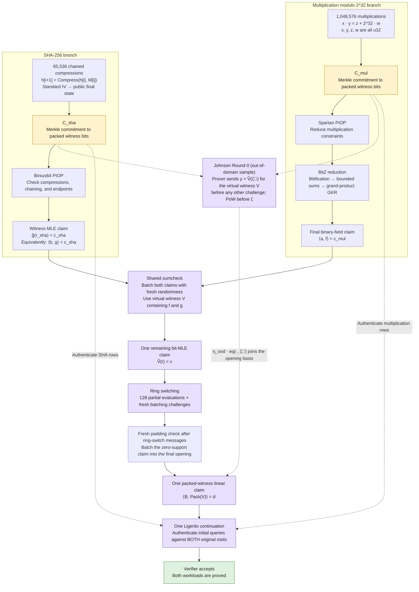

# Hybrid multiplication modulo 2^32 and SHA-256 proof

The two branches meet **after BitZ’s final GKR claim and Binius64’s SHA witness evaluation claim**.



- **Two original Merkle roots remain:** the virtual witness does not require a third initial tree.
- **One shared transcript:** both roots are bound before the proof challenges.
- **Round 0 comes first:** the shared opener defaults to the Johnson (list-decoding) regime, which the paper's theorem covers only with the out-of-domain sample. Right after the statement the prover sends `y = Ṽ(ζ⃗)`, `ζ⃗ = (ζ, ζ², ζ⁴, …)`, of the virtual packed witness, pinning it to one element of the level-0 list before the first Spartan, GKR or SHA challenge. The claim is folded into the final opening through one extra batching draw.
- **Matched UDR is optional:** `--profile udrg:3:4` selects the same commitment geometry and omits outer and recursive OOD claims. The padding check applies in both regimes.
- **SHA chaining is enforced:** every compression’s output feeds the next compression’s input state.
- **Target:** 100-bit security for the complete composition, non-ZK.

The public statement contains both commitment roots, circuit/workload parameters, and the final SHA chaining value. Multiplication operands `x, y`, modular results `z`, carries `w`, SHA message blocks, and intermediate chaining states are witness data. The standard SHA-256 initial state is fixed. The multiplication and SHA workloads are independent; multiplication results do not feed the SHA messages.

Every multiplication proves **`x * y = z + 2^32 * w`, with all four values bounded to 32 bits**. Thus `z = x * y mod 2^32`, and `w` is the high 32-bit carry. The integer PIOP reuses its exact-product relation by defining `p = z + 2^32 * w`. The committed bit slots are `x[0..32]`, `y[0..32]`, `z[0..32]`, and `w[0..32]`; F2Z's fixed reconstruction binds the last 64 bits to `p`. This checks the supplied modular result and carry inside the proof. It does not rely on a host-side truncation being correct.

The implementation is available behind the `hybrid` Cargo feature. It uses the protocol order above, including two-root initial authentication and the shared bit sumcheck before ring switching. The multiplication and SHA inputs remain independent.

## Run it

From the repository root, build with the CPU's field-arithmetic instructions enabled:

```bash
RUSTFLAGS="-C target-cpu=native" cargo build --release --features hybrid --bin hybrid-u32-sha256
```

A small example proves 32,768 multiplications modulo 2^32 and four chained compressions, saves the proof and public statement, and verifies the result:

```bash
RAYON_NUM_THREADS=8 target/release/hybrid-u32-sha256 \
  --mul-log 15 --sha-log 2 --output /tmp/hybrid-proof.bin

RAYON_NUM_THREADS=8 target/release/hybrid-u32-sha256 \
  --verify /tmp/hybrid-proof.bin
```

The output files are the proof, `<proof>.statement.bin` (the public statement), and `<proof>.statement.txt` (a readable copy). Verification requires the first two files; it does not use the original operands or message blocks.

The current protocol uses transcript domain `f2z/hybrid-u32-mod32-sha256/non-zk/lanes4-padding/v4` and `BZSH` proof encoding version 4. Older versions are rejected. Version 4 binds the logical/physical source dimensions and mapping version, uses literal `initial_k=4`, and authenticates zero padding in both decoding regimes. It supports Johnson `custom:3:4` by default and matched UDR `udrg:3:4`.

For logical packed-source logs `l0,l1`, let `L=max(l0,l1)`, `P=L-3`, `p_b=max(l_b,P)`, and `k_b=p_b-P`. Source `b` is padded to `2^p_b` words; physical index `i` maps to `((i >> k_b) << 4) + (b << 3) + (i mod 2^k_b)`. This forms sixteen virtual lanes. After ring-switch messages, a fresh challenge batches a zero-valued claim outside the logical supports into the authenticated opening using three equality bases.

`--profile` overrides `F2Z_LIG_PROFILE` and affects only Ligerito. Verifying a UDR proof requires the same `--profile udrg:3:4` selection. Metadata is printed as `LIGERITO_CONFIG <JSON>` on stderr and saved as `<proof>.ligerito.json`; it includes the resolved configuration, fingerprint, target, OOD accounting and protocol identity.

The agreed full workload is the default:

```bash
RAYON_NUM_THREADS=8 target/release/hybrid-u32-sha256 --output /tmp/hybrid-full.bin
```

This means **1,048,576 multiplications modulo 2^32 and 65,536 chained SHA-256 compressions**. Circuit preparation for the full SHA chain is substantial and is reported separately from proving. There is no SHA final-padding block added automatically: the public result is the final chaining value after precisely that many compression calls.

Use `--help` for flags. `--mul-log` supports 15–20, and `--sha-log` supports 1–16. Both specify base-two logarithms. The `unchecked` feature is rejected by the hybrid setup.

## Sweep equal witness sizes

The two operation counts are independently configurable. Equal operation counts and equal committed witness sizes are different experiments. To use equal counts, set both log flags to the same value; the currently supported intersection is 15–16. For example, `--mul-log 15 --sha-log 15` selects 32,768 multiplications and 32,768 chained compressions.

For **equal packed committed witness sizes**, the current implementation uses one 128-bit packed word per multiplication and 256 packed words per SHA compression. A multiplication contributes four 32-bit values: `x, y, z, w`. Splitting the former 64-bit product into its result and carry preserves the packed geometry. SHA's size includes internal circuit values and power-of-two padding, beyond the message blocks alone. Consequently:

```text
multiplications = 256 × sha_compressions
mul_log = sha_log + 8
bytes per branch = 16 × 2^mul_log
```

| Packed witness per branch | Multiplications | Chained compressions | Flags |
|---:|---:|---:|---|
| 512 KiB | 32,768 | 128 | `--mul-log 15 --sha-log 7` |
| 1 MiB | 65,536 | 256 | `--mul-log 16 --sha-log 8` |
| 2 MiB | 131,072 | 512 | `--mul-log 17 --sha-log 9` |
| 4 MiB | 262,144 | 1,024 | `--mul-log 18 --sha-log 10` |
| 8 MiB | 524,288 | 2,048 | `--mul-log 19 --sha-log 11` |
| 16 MiB | 1,048,576 | 4,096 | `--mul-log 20 --sha-log 12` |

These sizes describe each original packed witness before encoding and Merkle commitments; total packed witness storage is twice the table entry. They exclude circuit setup, public values, temporary prover allocations and commitment storage. Equal witness sizes do not imply equal proving time. The default million-multiplication/65,536-compression workload has 16 MiB and 256 MiB packed witnesses, respectively.

The benchmark has a built-in sweep. From the repository root, run all six matched-witness sizes with one command:

```bash
RUSTFLAGS="-C target-cpu=native" RAYON_NUM_THREADS=8 \
  cargo bench --bench hybrid_u32_sha256 --features hybrid -- --sweep
```

`--sweep` defaults to hybrid mode, one discarded warmup and five measured iterations per size. It runs each size/backend in a separate process using the same executable and inherited thread settings, so peak RSS does not carry over between shapes. Every iteration proves and verifies. Every case reuses one setup; the warmup is excluded from sample rows and setup is reported separately.

To select custom pairs and compare all three backends:

```bash
RUSTFLAGS="-C target-cpu=native" RAYON_NUM_THREADS=8 \
  cargo bench --bench hybrid_u32_sha256 --features hybrid -- \
  --sweep --shapes 15:7,16:8 --mode all --iterations 5
```

Each `--shapes` pair is `MUL_LOG:SHA_LOG`: `15:7` means 32,768 multiplications and 128 chained compressions. Pairs run in the supplied order; they need not have equal witnesses. For example, `--shapes 20:7,20:8,20:9` holds multiplications at 1,048,576 while increasing compressions. Multiplication logs must be 15–22 and SHA logs 1–16. Duplicate pairs and combinations of `--sweep` with single-run size/proof flags are rejected. The all-Binius mode processes the same operations, but its multiplication witness layout differs from the hybrid branch's layout. All modes keep the security settings described below.

The sweep prints readable progress and sample results to stdout. Each sample identifies its backend and multiplication/SHA sizes, labels prover and verifier time, and reports proof size, peak RSS and successful verification. Hybrid samples also show witness/commitment time, PIOP time broken down by multiplication/Spartan and SHA, and IOP time broken down by multiplication F2Z/GKR, joint sumcheck and the shared opening. Setup is reported once per workload and excluded from prover time; peak RSS includes setup and is cumulative within that workload's process. The sweep creates a fresh `sweep-<timestamp>-<pid>/` under `benches/results/hybrid-u32-sha256/` containing:

- `summary.csv`: all verified samples, with `multiplication_relation=u32_mod_2_32`, mode, operation counts, log sizes and timings. Exact proof sizes and separate-mode payload estimates use distinct columns; unavailable metrics are blank. Read this file for machine-readable output; stdout displays the labelled results.
- `<mode>-m<MUL_LOG>-s<SHA_LOG>.csv` and `.log`: original samples and setup/stage diagnostics for each process.
- `<mode>-m<MUL_LOG>-s<SHA_LOG>.ligerito.json`: validated Ligerito identity for hybrid/separate modes, also encoded in the `ligerito_hex` summary column. All-Binius has no Ligerito identity.
- `run.txt`: executable, multiplication relation, requested shapes, modes, iteration count, thread setting and security target.

The default `benches/results/` directory is ignored by Git. Use `--results-dir DIR` to choose a destination that does not already exist. A failed child stops the sweep, reports its log path and preserves completed results. Sweep code lives in [`benches/hybrid_u32_sha256/sweep.rs`](../benches/hybrid_u32_sha256/sweep.rs). The standalone CLI accepts the same sweep flags.

The hybrid setup log reports `packed_logs=[k, k]` when the two witnesses match. Library callers can check `let logs = prepared.packed_witness_logs(); assert_eq!(logs[0], logs[1]);`. The factor 256 is a property of the pinned SHA gadget and compiler, so check these actual logs again after either changes.

A version-1 smoke sweep on 2026-09-08 successfully generated and verified one hybrid proof at every size in the table and confirmed equal packed logs for all six pairs. Its CSVs and setup logs were saved locally under `benches/results/hybrid-u32-sha256/equal-witness/`; this historical sweep checked the old geometry and predates the explicit four-limb API and version-2 transcript. It is not a comparative speedup measurement. The built-in sweep creates a fresh directory to preserve those saved measurements.

## Library API

```rust
use f2z::hybrid::{Parameters, PreparedHybrid, U32MulMod32Row};

# fn main() -> Result<(), Box<dyn std::error::Error>> {
let parameters = Parameters {
    multiplications: 1 << 15,
    sha_compressions: 4,
};
let prepared = PreparedHybrid::new(parameters)?;
// Explicit witness claims: MAX * 2 = (2^32 - 2) + 2^32 * 1.
let row = U32MulMod32Row { x: u32::MAX, y: 2, z: u32::MAX - 1, w: 1 };
let rows = vec![row; parameters.multiplications];
let blocks = vec![[0x12345678u32; 16]; parameters.sha_compressions];

let committed = prepared.commit_mod32(&rows, &blocks)?;
assert_eq!(committed.multiplication_rows().next(), Some(row));
let statement = committed.statement().clone();
let proof = prepared.prove(&committed)?;
let bytes = proof.to_bytes();

let decoded = prepared.proof_from_bytes(&statement, &bytes)?;
prepared.verify(&statement, &decoded)?;
# Ok(())
# }
```

`commit_mod32` retains all four supplied limbs, including `z` and `w`; it does not replace them with recomputed outputs. Their consistency is checked by the proof. `U32MulMod32Row::new(x, y)` is a convenience constructor that computes a valid modular result and carry, and `row.packed_product()` reconstructs the supplied `z + 2^32 * w`. For callers with only operands, `prepared.commit(&operands, &blocks)` generates the same four-limb witness. `committed.multiplication_rows()` exposes the committed rows as an iterator.

Each block is sixteen words in SHA's standard word order; each word represents four big-endian message bytes. Commitment preparation generates intermediate SHA states and commits both packed witnesses. The public statement is obtained from `committed.statement()`. Setup can be reused across statements of the same shape. Decoding is bounded and requires the public statement to reconstruct the transcript-selected integer field; decoding alone does not accept a proof.

## Implementation boundaries

- `src/hybrid/mod.rs`: prepared relation, committed witness, prover and verifier APIs.
- `src/piop/spartan/u32_mul.rs`: explicit four-limb modular rows and their fixed reconstruction into the existing exact-product PIOP assignment.
- `src/hybrid/mod32_binius.rs`: four range-checked Binius limbs and the exact multiplication/reconstruction constraint used by the all-Binius comparison.
- `src/piop/spartan/f2z/hybrid.rs`: Spartan and the exponent GKR, stopped at a binary inner product; bounded integer read-off is checked by the verifier.
- `src/hybrid/sha.rs`: constrained sequential two-compression gadget, fixed IV and public final state.
- `src/hybrid/channel.rs`: Binius messages and challenges on the same BLAKE3 transcript as the integer branch.
- `src/hybrid/sumcheck.rs`: shared degree-two sumcheck. The first seven rounds use linear byte tables over packed bits, without a field element per original bit. Subsequent rounds allocate tables over the virtual packed domain.
- `src/hybrid/opening.rs`: Round 0 (the out-of-domain sample, on the audited primitives of `src/ligerito_flock.rs`), ring switching, virtual lane layout, and one Ligerito continuation. Every original row slice and every zero-padding lane is checked.
- `src/hybrid/codec.rs`: versioned proof encoding with canonical integer residues, bounded counts and no trailing bytes.
- `src/hybrid/security.rs`: composition error budget and explicit parameter rejection below the target.

The two minimal dependency forks live under `vendor/binius64` and `vendor/flock-mod`; their `VENDORED.md` files record upstream revisions. Binius exposes its pre-ring-switch witness evaluation; Flock exposes application-supplied initial authentication. Their ordinary opening APIs retain their original backends.

## Security target and scope

The experiment is non-ZK. Its modeled composition gate requires at least 100 bits, including Round-0, integer-prefix, GKR, binary PIOP, batching, padding, ring-switch and Ligerito error terms. The integer component retains its 108-bit budget. The shared Ligerito opener has a 106-bit target and rate 1/8 with `initial_k=4` in both regimes. Separate mode uses a 112-bit F2Z opener; separate/all-Binius native Binius configurations remain unchanged.

Johnson's outer OOD uses `IopSecurityParams::adopt_ood_round`, including the existing 24-bit grinding cap. Native Ligerito fold/query grinding is reported separately. The fresh padding check contributes `(L+2)/2^128` to the modeled error budget. Roots, dimensions, final SHA state, mapping/protocol version and resolved configuration are bound before OOD and the PIOP challenges. UDR omits the OOD claims and retains the padding check.

`prepared.security()` reports component terms and the modeled composition bound. Raw statistical error and economic grinding are distinct; grinding does not reduce the raw statistical error. BLAKE3 Fiat–Shamir and Merkle hashing remain cryptographic assumptions. The four-limb interpretation preserves the integer defect bound because both `x*y` and `z + 2^32*w` fit in 64 bits. See the [coverage matrix](ligerito-coverage.md) for supported shapes and current validation.

## Compare performance

The benchmark entry point is `benches/hybrid_u32_sha256.rs`. Run a small matched-witness benchmark through Cargo:

```bash
RUSTFLAGS="-C target-cpu=native" RAYON_NUM_THREADS=8 \
  cargo bench --bench hybrid_u32_sha256 --features hybrid -- \
  --mode hybrid --mul-log 15 --sha-log 7 --iterations 5
```

It accepts the same flags as the standalone runner. Use `--sweep` as described above to automate multiple sizes and save results. For a single run, save stdout as CSV and stderr as its corresponding setup/stage log under a fresh directory in `benches/results/hybrid-u32-sha256/`.

Run modes in separate processes with the same thread count, build and inputs:

```bash
RAYON_NUM_THREADS=8 target/release/hybrid-u32-sha256 --mode hybrid --iterations 5
RAYON_NUM_THREADS=8 target/release/hybrid-u32-sha256 --mode separate --iterations 5
RAYON_NUM_THREADS=8 target/release/hybrid-u32-sha256 --mode all-binius --iterations 5
```

All modes generate the same deterministic operands and chained SHA blocks and use BLAKE3 Merkle hashing. Each mode generates its four-limb multiplication rows within the timed iteration. Hybrid and separate modes compile the supplied limbs through `p = z + 2^32 * w` into the integer PIOP. The separate mode uses the same integer component profile plus Binius SHA. The all-Binius mode allocates four witness wires, range-checks each to 32 bits, and checks the exact multiplication against `z XOR (w << 32)`; the disjoint limbs make this equal to `z + 2^32 * w`. It proves the same SHA chain. Binius FRI uses 112 bits, rather than its default 96-bit configuration, to leave composition slack.

CSV reports setup time, total prover time including witness generation and initial commitments, verification, proof bytes and process peak RSS. Hybrid also separates witness/commit time from continuation time. Setup is excluded from total prover time and explicitly reported. Run processes separately for memory comparisons: peak RSS includes setup and is cumulative across iterations. The separate mode's proof size is labeled as a payload estimate because the existing standalone u32 API has no enclosing wire codec. The first in-process proof is a discarded warmup; only subsequent proofs produce sample rows. The historical version-1 measurements below do **not** show a hybrid performance advantage; rerun the comparison to measure the current four-limb all-Binius circuit.

Hybrid phase timings are measured on every sample without additional flags:

- `mul_piop_ms`: multiplication constraint reduction through Spartan and bitification, including the prefix's transcript binding and grinding.
- `sha_piop_ms`: Binius SHA constraint reduction to its binary claim.
- `piop_ms`: the sum of those two constraint reductions.
- `mul_opening_ms`: prepare the multiplication F2Z claim, fold bounded sums, and run GKR to obtain its binary claim.
- `joint_sumcheck_ms`: combine the two binary claims through the shared bit sumcheck.
- `shared_opening_ms`: Round 0 (virtual witness assembly, grinding, and the out-of-domain evaluation), ring switching, and Ligerito with authentication against both roots. `ood_round_ms` reports the Round-0 part on its own; it is included in `shared_opening_ms`, not added to it again.
- `iop_ms`: the sum of `mul_opening_ms`, `joint_sumcheck_ms`, and `shared_opening_ms`. This counts F2Z/GKR as opening work, consistent with the existing standalone F2Z benchmarks. Initial commitments are counted in `witness_commit_ms` instead.

These are prover wall-clock times, including parallel work, and exclude setup and verification. `continuation_ms` encloses PIOP and IOP plus transcript initialization and logging overhead; `total_prover_ms` additionally includes witness generation, initial commitments and proof encoding. Nested profiling regions are not added again. The separate and all-Binius modes currently report total prover time; their phase columns in `summary.csv` are blank. Historical result files are unchanged and do not contain these new timing columns.

## Validation

```bash
RUSTFLAGS="-C target-cpu=native" RAYON_NUM_THREADS=4 \
  cargo test --release --lib --features hybrid hybrid::
```

Tests cover the SHA known-answer vector, field-representation agreement, chained proof round trips, serialization, and rejection of changed roots, output states, integer sums, opening values, padding and trailing data, plus the Round-0 value and nonce and the deeper levels' out-of-domain values and fold-grinding nonces. Modular tests check overflow boundaries, commit independently supplied limbs, and reject false relations after changing each of `x`, `y`, `z`, or `w`. Binius tests additionally check compiled constraints against out-of-range values in every limb, and verify a standalone proof of the modular gadget. A dense reference sumcheck checks the streamed rounds in both source-lane orders and the equal-size case. Current checks include both-regime balanced proof/codec roundtrips and malicious nonzero padding that is re-encoded and recommitted. See the [validation record](ligerito-coverage.md) for this pass; performance measurements remain deferred.

Before the explicit mod-2^32 API change, the built-in sweep was validated with all six default shapes and three verified samples each, plus two custom shapes across all three backends. The historical summaries are local benchmark artifacts and are not tracked in Git. Checks also covered malformed/out-of-range/duplicate shapes, conflicting flags, existing-output-directory preservation, and terminating a child after the first shape completed: the sweep returned failure, retained the completed summary row and identified the failed child's log. These saved runs do not validate the new four-limb all-Binius circuit or version-2 proof encoding.


The version-2 modular sweep completed all six matched-witness sizes in all three modes, with one verified sample per pair/backend (18 total), including 1,048,576 modular multiplications and 4,096 chained compressions. Results and build metadata are local benchmark artifacts and are not tracked in Git. The CLI also generated and independently verified a saved version-2 proof and rejected a saved version-1 proof.

## Historical version-1 measurements — 2026-09-08

All measurements in this section predate the explicit `U32MulMod32Row` API and version-2 hybrid transcript. The earlier hybrid and separate branches proved `u32 × u32 → u64` using the same 128 committed bits now interpreted as four u32 limbs. The earlier all-Binius circuit had three witness wires (`x`, `y`, and a 64-bit product); the current circuit has four separately range-checked limbs. Preserve these historical numbers and CSVs, but do not report them as measurements of the current modular benchmark.

Machine: AMD Ryzen 9 9950X3D, 16 physical cores / 32 logical CPUs, about 59 GiB RAM. Runs used eight Rayon threads, Rust 1.97.1 and `-C target-cpu=native`. These exploratory measurements used the release optimization level with **LTO disabled and 16 codegen units** to shorten integration-build turnaround. The normal repository release profile uses fat LTO; repeat the comparison with that profile before drawing a production performance conclusion.

The version-1 full hybrid workload completed proof generation and successful verification:

| Multiplications | Chained compressions | Setup | Total prover | Verifier including decode | Proof bytes | Peak process RSS |
|---:|---:|---:|---:|---:|---:|---:|
| 1,048,576 | 65,536 | 128.65 s | 3.60 s | 0.883 s | 2,541,368 | 53.37 GiB |

The computed algebraic/IOP bound for this shape was **102.52 bits**. Witness generation and initial commitments took 0.620 s; the continuation took 2.979 s. The benchmark process was interrupted after it emitted this successfully verified measurement row; no further full-size trials were recorded. Setup dominates first-use latency and peak memory. This is a single full-size measurement, not a full-size comparative speedup result.

The smaller comparison keeps the same 16:1 multiplication/compression ratio: **32,768 products and 2,048 chained compressions**. Each mode ran in its own process with three trials. The warm figure is the mean of trials 1 and 2; it is only two samples.

| Mode | Setup | First prover | Warm prover mean | Warm verifier mean | Proof size |
|---|---:|---:|---:|---:|---:|
| Hybrid, final scheduling | 3.60 s | 118.6 ms | 116.3 ms | 35.5 ms | 2,361,632 bytes |
| Hybrid, before scheduling change | 3.84 s | 153.8 ms | 168.1 ms | 35.1 ms | 2,361,632 bytes |
| Separate BitZ + Binius | 3.55 s | 76.3 ms | 78.8 ms | 32.0 ms | ~500,448 payload bytes |
| All-Binius | 3.72 s | 100.5 ms | 93.5 ms | 33.9 ms | 470,240 bytes |

**Historical result:** the version-1 shared-opening prototype was approximately 1.5× slower than separate proofs and 1.2× slower than all-Binius on this smaller workload. Its proof was also larger. Parallelizing whole multiplication LUT blocks, while parallelizing the long SHA scan within its one block, reduced the hybrid warm mean by about 31% (168.1 ms to 116.3 ms). That scheduling change preserved the exact version-1 proof bytes; the dense-reference test covers both schedules. The full-size measurement above predates the scheduling improvement. A performance advantage remains an optimization objective. Stage timestamps at the smaller shape put the remaining shared bit sumcheck around 32 ms; its virtual packed field tables and the initial opening are candidates for further profiling. Circuit setup memory was a separate major issue at the full shape.

Raw CSVs and their setup/stage logs were saved locally in `benches/results/hybrid-u32-sha256/` and are not tracked in Git. The separate-mode CSV uses the older `proof_bytes` header for its explicitly labeled payload estimate; current runner versions name that column `proof_payload_bytes_estimate`.

To reuse the exploratory build settings for a fresh measurement of the current modular implementation:

```bash
RUSTFLAGS="-C target-cpu=native" \
CARGO_PROFILE_RELEASE_LTO=false CARGO_PROFILE_RELEASE_CODEGEN_UNITS=16 \
  cargo build --release --features hybrid --bin hybrid-u32-sha256

RAYON_NUM_THREADS=8 target/release/hybrid-u32-sha256 \
  --mode hybrid --mul-log 15 --sha-log 11 --iterations 5
```

Repeat the last command with `--mode separate` and `--mode all-binius`. Omit both size flags for the full shape. The local integration build cache remains under `target/hybrid-build`. Local benchmark measurements live under the Git-ignored `benches/results/hybrid-u32-sha256/`; write future measurements into fresh subdirectories to preserve the recorded results.
